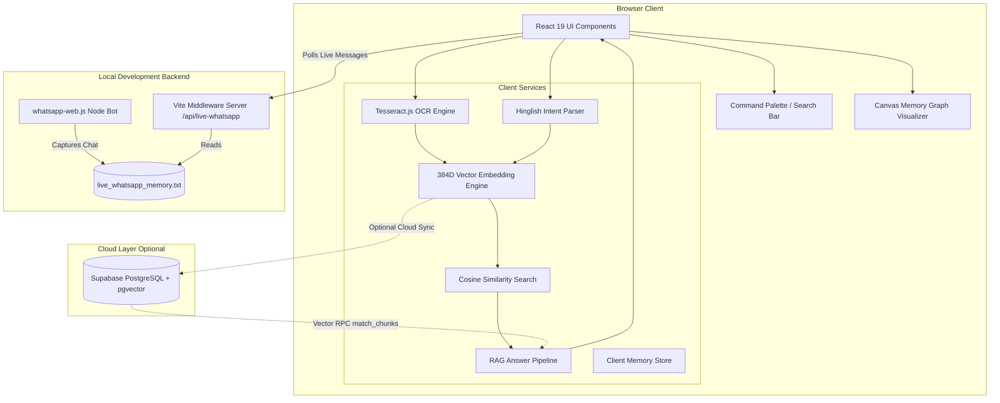

# 🧠 ECHO

## Your conversations become searchable memory.

ECHO is an AI-powered team memory and context retrieval system designed to eliminate context fragmentation across modern software engineering teams. By continuously ingesting multimodal communication streams—including chat text, documents, screenshots, and live messaging streams—ECHO constructs a searchable context graph that surfaces the true story behind team decisions, commitments, and blockers.

---

### 🚀 Submission Links

- **🚀 Live Demo**: [https://echo-iota-pink.vercel.app/](https://echo-iota-pink.vercel.app/)
- **🎥 Demo / Pitch Video**: [ADD VIDEO URL HERE]
- **📑 Presentation**: `./docs/presentation.pdf`
- **💻 Original Development Repository**: [https://github.com/jatinJadoun324/ECHO-](https://github.com/jatinJadoun324/ECHO-)
- **🏆 HackIndia Submission Repository**: [https://github.com/HackIndiaXYZ/hack-synapse-2026-mits-du-gwalior-madhya-pradesh-error-404](https://github.com/HackIndiaXYZ/hack-synapse-2026-mits-du-gwalior-madhya-pradesh-error-404)

---

## 1. THE PROBLEM

Modern engineering teams communicate across a fragmented maze of platforms—WhatsApp group chats, Slack channels, meeting notes, code commits, and shared screenshot snippets. Over time, critical context disappears into chat scrollbacks.

### Key Pain Points
- **Context Fragmentation**: Decisions are made across scattered threads and lost over time.
- **Hidden Blockers**: Engineers become blocked (e.g., waiting on API endpoints or authentication fixes), but the blocker remains buried in prose.
- **Missed Commitments**: Verbal deadlines ("kal tak complete kar dunga") pass unnoticed without central tracking.
- **Inefficient Retrieval**: Finding out *why* a decision was made requires searching hundreds of raw chat lines.

```text
Before ECHO:
50 messages → search manually → lose context

With ECHO:
Question → retrieve relevant context → understand the story
```

---

## 2. THE SOLUTION

ECHO transforms unstructured team communication into an indexed, searchable memory engine. 

Instead of treating chat logs as static text, ECHO executes a continuous pipeline:
$$\text{Capture} \longrightarrow \text{Process} \longrightarrow \text{Represent} \longrightarrow \text{Retrieve} \longrightarrow \text{Respond} \longrightarrow \text{Surface Insights}$$

It allows any team member to query the project's history in plain English or **Hinglish** (Romanized Hindi) and receive synthesized answers supported by direct conversational evidence.


---

## 3. HOW IT WORKS

### Technical Query & Retrieval Flow

When a user submits a query to ECHO (e.g., *"What did Rahul say about the backend deadline?"* or *"Rahul ka kya status hai?"*):

```text
User Query
   ↓
Hinglish / English Query Preprocessing
   ↓
384-Dimensional Vector Embedding (Deterministic Hash + Concept Weights)
   ↓
Top-K Cosine Similarity Search over Memory Chunks
   ↓
Context & Evidence Retrieval
   ↓
RAG Answer Synthesis & Highlight Extraction
   ↓
Grounded Answer + Evidence Cards + Risk Insights
```

### Ingestion Pipeline Architecture

1. **Multimodal Ingestion**:
   - **Text Files (`.txt`, `.json`, `.csv`)**: Parsed line-by-line into clean message chunks containing speaker, timestamp, and body.
   - **Image Screenshots (`.png`, `.jpg`)**: Scanned using **Tesseract.js** in-browser OCR, followed by regex noise filtering to strip URL strings and OCR artifacts.
   - **Live WhatsApp Stream**: Ingested via local Node.js middleware (`whatsapp-web.js`) polling `/api/live-whatsapp`.
2. **Hinglish Intent Parsing**:
   - Messages are evaluated through a dictionary-based Hinglish parser that maps code-mixed phrasing (`kal tak`, `fas gaya`, `ruka hua hai`) to intent tags (`COMMITMENT`, `BLOCKER`, `DEPENDENCY`, `URGENCY`).
3. **Deterministic Vector Representation**:
   - Chunks are vectorized into 384-dimensional normalized vectors with domain concept boosts for key terms (`auth`, `backend`, `deadline`, `frontend`).


## 4. KEY FEATURES

### Memory & Search
Performs instant vector similarity search over team conversations and ingested files to retrieve precise message chunks and conversational evidence.

### Ask ECHO (RAG Query Engine)
Natural language query interface supporting multi-lingual English and Hinglish queries. Synthesizes concise answers, highlights key entities, and displays source evidence cards.

### Memory Timeline
Chronological audit trail of team updates, commitments, blockers, and ingested chat events.

### Interactive Context Graph
Visual SVG/Canvas graph representing connections between team members, core topics, active commitments, and project blockers.

### Insights & Risk Detection
Automated project health analyzer that surfaces workflow risks (e.g., identifying when backend authentication issues are blocking frontend integration).

### Document Ingestion
Client-side drag-and-drop ingestion pipeline for text files (`.txt`, `.json`, `.csv`) with real-time vector chunking.

### Client-Side OCR
Integrates `Tesseract.js` to extract conversational text directly from uploaded dark-mode or light-mode mobile screenshots.

### Hinglish NLP Processing
Translates Romanized Hindi team idioms into structured intent categories (`COMMITMENT`, `BLOCKER`, `DEPENDENCY`, `URGENCY`).

### WhatsApp Integration
Local Node.js headless browser runner (`whatsapp-web.js`) with QR code terminal authentication to capture live incoming WhatsApp messages.

### Command Palette (`⌘K` / `Ctrl+K`)
Global keyboard-accessible command overlay for rapid navigation and instant memory queries.

### Modern Responsive UI
Custom Tailwind CSS v4 design system with smooth theme switching between Light and Dark modes.

---

## 5. PRODUCT WALKTHROUGH

| View / Screen | Key Capabilities |
| :--- | :--- |
| **Overview** | High-level dashboard displaying Project Health status, active risk alerts, quick query launcher, and the interactive Live Memory Graph visualizer. |
| **Ask ECHO** | RAG search workspace featuring pre-set demo prompts, Hinglish input processing, answer synthesis cards, and source evidence attribution. |
| **Timeline** | Chronological feed of team updates, commitments, and imported conversation events with source filtering. |
| **Sources** | Storage manager displaying ingested documents, vector chunk counts, source file metadata, document preview drawer, and custom file uploader. |
| **Insights** | Dedicated analytical view breaking down project risks, team velocity signals, and active dependency chains. |
| **Team Memory** | Team directory highlighting individual member focuses, overdue commitments, current blockers, and message history drawers. |
| **Project Brain** | Raw chunk browser allowing inspection of generated 384D vector embeddings and chunk metadata. |
| **Settings** | Configuration panel for managing Supabase database connections and toggling system dark/light themes. |

---

## 6. TECHNOLOGY STACK

| Layer | Technology | Version | Purpose |
| :--- | :--- | :--- | :--- |
| **Frontend Framework** | React | `^19.2.8` | Core UI component framework |
| **DOM Renderer** | React DOM | `^19.2.8` | React DOM rendering engine |
| **Build Tool & Dev Server** | Vite | `^8.2.2` | Fast HMR dev server and production builder |
| **Vite React Plugin** | `@vitejs/plugin-react` | `^6.1.0` | React support for Vite build system |
| **Styling Framework** | Tailwind CSS | `^4.3.3` | Utility-first CSS engine |
| **Tailwind Vite Plugin** | `@tailwindcss/vite` | `^4.3.3` | Tailwind v4 compilation for Vite |
| **Icon Library** | Lucide React | `^1.34.0` | UI icon components |
| **Class Utilities** | `clsx` & `tailwind-merge` | `^2.1.1` / `^3.6.0` | Dynamic class name composition |
| **OCR Engine** | Tesseract.js | `^7.0.0` | Client-side optical character recognition |
| **WhatsApp Bot Automation**| `whatsapp-web.js` | `^1.34.7` | Headless WhatsApp Web client |
| **Terminal QR Code** | `qrcode-terminal` | `^0.12.0` | Terminal QR rendering for WhatsApp authentication |
| **Cloud Database (Optional)**| `@supabase/supabase-js` | `^2.112.4` | Persistent cloud database & vector RPC client |
| **Linter** | Oxlint | `^1.79.0` | High-performance JavaScript/JSX linter |
| **Vector Engine** | Custom JS Module | N/A | 384D deterministic embedding & Cosine Similarity search |
| **NLP Engine** | Custom JS Module | N/A | Rule-based Hinglish dictionary & intent extractor |
| **RAG Pipeline** | Custom JS Module | N/A | Search retrieval, answer synthesis, and evidence formatter |
| **Server Middleware** | Custom Vite Middleware | N/A | Local Node API endpoint (`/api/live-whatsapp`) for live chat polling |

> **Development Environment Note**:  
> **Antigravity IDE** was utilized as the AI-powered development environment during the creation and iteration of the ECHO codebase.

---

## 7. ARCHITECTURE



---

## 8. PROJECT STRUCTURE

```text
ERROR 404/
├── public/
│   ├── _redirects              # SPA route rewrite configuration for Cloudflare Pages
│   ├── favicon.svg             # App favicon
│   └── icons.svg               # SVG icon sheet
├── scripts/
│   ├── whatsapp-personal-bot.js    # Live WhatsApp Web Bot runner (ES Module)
│   └── whatsapp-personal-bot.cjs   # Live WhatsApp Web Bot runner (CommonJS)
├── src/
│   ├── assets/                 # Brand assets and graphics
│   ├── components/
│   │   ├── common/             # Badges, Logo, Memory Graph Visualizer, Pitch Bar
│   │   ├── layout/             # Header, Sidebar, Command Palette
│   │   ├── modals/             # Upload Modal, WhatsApp Live Modal, Member Drawer
│   │   └── views/              # Overview, Ask ECHO, Timeline, Sources, Insights, Team, Settings, ProjectBrain
│   ├── services/
│   │   ├── embeddingEngine.js  # 384D vector generation & Cosine Similarity search
│   │   ├── hinglishParser.js   # Hinglish dictionary translator & intent classifier
│   │   ├── ingestionEngine.js # Multimodal file chunker & processor
│   │   ├── liveSyncService.js # Live WhatsApp API polling service
│   │   ├── memoryStore.js     # Seed dataset & memory state definitions
│   │   ├── ocrEngine.js        # Tesseract.js image OCR & noise cleaning
│   │   ├── ragEngine.js        # RAG retrieval & answer synthesis pipeline
│   │   └── supabaseClient.js   # Supabase client initializer
│   ├── App.jsx                 # Main application view manager & state container
│   ├── index.css               # Global Tailwind CSS styles
│   └── main.jsx                # Application entrypoint
├── supabase/
│   └── schema.sql              # PostgreSQL tables & vector search RPC functions
├── vercel.json                 # Vercel SPA rewrite configuration
├── vite.config.js              # Vite config & custom live API middleware
├── package.json                # Dependencies and project scripts
├── .env.example                # Environment variable template
└── README_HACKATHON.md         # Comprehensive Hackathon README documentation
```

### Core Service Files

- **`embeddingEngine.js`**: Generates 384-dimensional vector representations using deterministic character hashing, keyword semantic weights, and L2 vector normalization. Calculates Cosine Similarity between vector pairs.
- **`ragEngine.js`**: Executes the RAG query pipeline. Combines live custom memory chunks with indexed base memory, runs vector similarity search, synthesizes answers, extracts key highlights, and formats evidence cards.
- **`hinglishParser.js`**: Parses Hinglish code-mixed chat lines and extracts intent tags (`COMMITMENT`, `BLOCKER`, `DEPENDENCY`, `URGENCY`) using a specialized dictionary.
- **`ingestionEngine.js`**: Processes text files, JSON, CSV, and images into normalized semantic chunks. Handles cloud synchronization when Supabase is configured.
- **`ocrEngine.js`**: Manages `Tesseract.js` worker lifecycle for image OCR scanning and applies heuristic noise filtering for mobile chat screenshots.
- **`liveSyncService.js`**: Performs periodic client polling against the `/api/live-whatsapp` endpoint to update client memory in real time.
- **`memoryStore.js`**: Manages in-memory state and initial team seed data (Rahul, Aman, Priya, Jatin).
- **`supabaseClient.js`**: Initializes the `@supabase/supabase-js` client conditionally based on environment variables.

---

## 9. LOCAL DEVELOPMENT

### Prerequisites

- **Node.js**: `v18.0.0` or higher
- **npm**: `v9.0.0` or higher

### Setup Instructions

1. **Clone the repository**:
   ```bash
   git clone https://github.com/jatinJadoun324/ECHO-.git
   cd ECHO-
   ```

2. **Install dependencies**:
   ```bash
   npm install
   ```

3. **Configure Environment Variables** *(Optional)*:
   ```bash
   cp .env.example .env.local
   ```

4. **Start the Development Server**:
   ```bash
   npm run dev
   ```
   Open `http://localhost:5173` in your browser.

5. **Run Linting**:
   ```bash
   npm run lint
   ```

6. **Run Production Build**:
   ```bash
   npm run build
   ```

### Running the Live WhatsApp Bot (Optional)

To stream live WhatsApp group chat messages into your local dev server:

```bash
node scripts/whatsapp-personal-bot.js
```
Scan the displayed terminal QR code using WhatsApp on your phone (**Linked Devices** > **Link a Device**).

---

## 10. ENVIRONMENT VARIABLES

ECHO functions out-of-the-box using in-memory state. To enable persistent cloud vector storage via Supabase, set the following environment variables in `.env.local`:

```env
# Supabase Cloud Database Credentials (Optional)
VITE_SUPABASE_URL=https://your-supabase-project.supabase.co
VITE_SUPABASE_ANON_KEY=your-supabase-anon-key
```

---

## 11. DEPLOYMENT

The ECHO web client is deployed and hosted live on **Vercel**:

- 🌐 **Live Application URL**: [https://echo-iota-pink.vercel.app/](https://echo-iota-pink.vercel.app/)

### Vercel Deployment Configuration
The repository includes a [`vercel.json`](file:///Users/kaizen/Downloads/ERROR%20404/vercel.json) configuration file that handles client-side SPA routing:

```json
{
  "rewrites": [
    { "source": "/(.*)", "destination": "/index.html" }
  ]
}
```

> **Deployment Note regarding WhatsApp Bot Middleware**:  
> The live WhatsApp synchronization bot runs as a local Node.js process (`scripts/whatsapp-personal-bot.js`) communicating via local dev server middleware (`/api/live-whatsapp`). On static serverless deployments (such as Vercel), the application falls back gracefully to in-browser OCR, document uploads, and local client memory.

---

## 12. LIMITATIONS & FUTURE IMPROVEMENTS

To maintain technical transparency for hackathon evaluation, the current MVP limitations and planned production improvements are outlined below:

### Current MVP Limitations
- **Custom Vector Generator**: The current embedding engine uses deterministic character hashing with keyword domain weights rather than a transformer-based neural model (e.g. OpenAI `text-embedding-3` or HuggingFace Transformers).
- **Serverless Live WhatsApp Sync**: Live WhatsApp streaming relies on a local Node.js process (`whatsapp-web.js`) and local dev server middleware, which is not hosted on static serverless deployments.
- **Rule-Based Hinglish NLP**: Intent extraction uses a dictionary lookup rather than a fine-tuned multilingual LLM classifier.
- **Single-Tenant Memory**: Memory is scoped to the current browser session or single shared Supabase database without user authentication or multi-tenant RBAC.

### Production Roadmap & Future Improvements
- 🚀 **Neural Embedding Models**: Upgrade to transformer-based embeddings (e.g., OpenAI or sentence-transformers) for deeper semantic representation.
- ☁️ **Cloud Ingestion Worker**: Deploy the WhatsApp/Slack ingestion engine as a persistent background microservice (Docker/ECS) for continuous cloud sync.
- 🤖 **LLM Synthesis Engine**: Integrate external LLMs (e.g., Anthropic Claude or Google Gemini) for richer conversational summary generation.
- 🔒 **Enterprise Security & Multi-Tenancy**: Add OAuth2/SAMLS user authentication with organization-level access control.
- 🔌 **Native Integrations**: Expand data connectors to include Slack Webhooks, Discord API, Notion, and GitHub pull requests.

---

## 13. TEAM

# 👥 Team ERROR 404

- **Ayushi Shrivastava** — *Project Lead & System Architect* [[GitHub / LinkedIn]]
- **Jatin Jadoun** — *Technical Lead & UI Developer* [[GitHub / LinkedIn]]
- **Pallavi Patkar** — *Design & Presentation Lead* [[GitHub / LinkedIn]]
- **Saksham Upadhyay** — *Research Lead* [[GitHub / LinkedIn]]

---

## 14. HACKSYNAPSE 2026

Built for **HackSynapse 2026**.

**Team ERROR 404**

**ECHO — Your conversations become searchable memory.**

---

## 15. LICENSE

This repository currently does not contain an explicit open-source license file. All rights reserved by **Team ERROR 404**.
